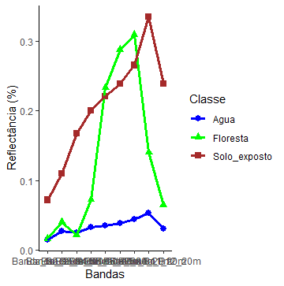

# Extração de assinatura espectral dos alvos

Script para extração de assinatura espectral de classes de diferentes objetos.

O repositório contém o script, as amostras e as bandas utilizadas.

## Exemplo do gráfico de assinatura espectral

